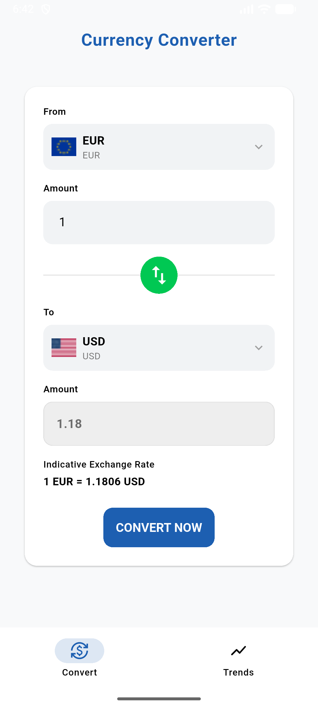
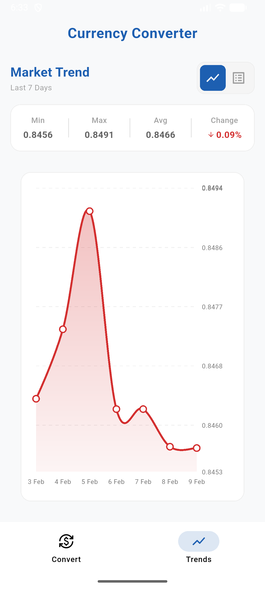
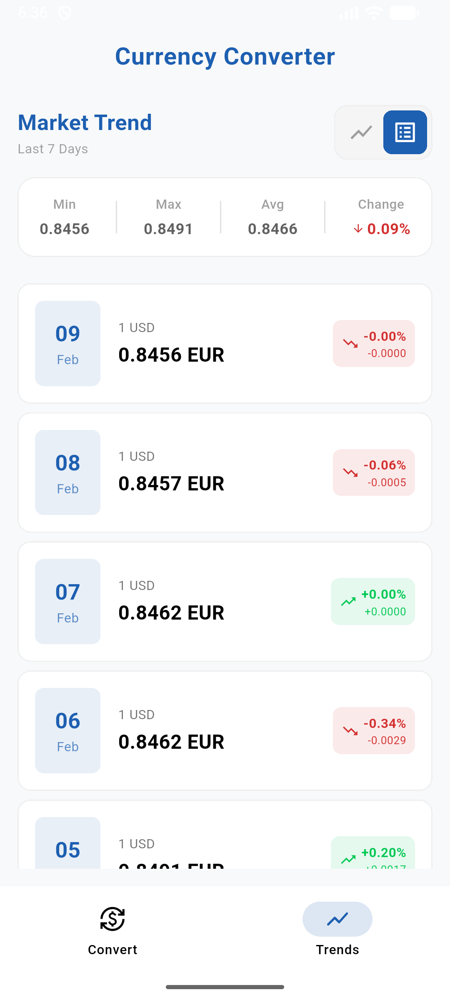

# 💱 Flutter Currency Converter

A modern, cross-platform currency converter application built with **Flutter** and **Clean Architecture**. Features real-time exchange rates, offline caching, historical data visualization, and comprehensive unit testing.

[](https://flutter.dev)
[](https://dart.dev)
[](LICENSE)

## ✨ Features

- 🌍 **813+ Currencies** - Support for all major and minor world currencies
- 💹 **Real-Time Rates** - Live exchange rate data from UniRateAPI
- 📊 **Historical Charts** - Visualize currency trends over time
- 🔄 **Offline Support** - Cached data for offline access
- 🎨 **Modern UI** - Clean, intuitive interface with smooth animations
- 🧪 **100% Tested** - Comprehensive unit tests (25 passing tests)
- 🌐 **Cross-Platform** - Android, iOS, Web, Windows, macOS, Linux

## 📱 Screenshots

<p align="center">
  
  
  
</p>

> **Design Inspiration**: UI design inspired by [Currency Converter Figma Template](https://www.figma.com/community/file/1215141639571590423)

## 🏗️ Architecture

This project follows **Clean Architecture** principles with clear separation of concerns:

```
lib/
├── core/                    # Shared utilities and base classes
│   ├── di/                  # Dependency injection (GetIt + Injectable)
│   ├── error/               # Error handling (Failures & Exceptions)
│   ├── network/             # Network connectivity checks
│   ├── theme/               # App theming and design tokens
│   └── usecases/            # Base UseCase interface
│
├── features/
│   └── currency/
│       ├── domain/          # Business logic layer
│       │   ├── entities/    # Pure Dart models
│       │   ├── repositories/# Abstract repository contracts
│       │   └── usecases/    # Business use cases
│       │
│       ├── data/            # Data layer
│       │   ├── datasources/ # Remote (API) & Local (Hive) sources
│       │   ├── models/      # Data models with JSON serialization
│       │   └── repositories/# Repository implementations
│       │
│       └── presentation/    # UI layer
│           ├── bloc/        # BLoC state management
│           ├── views/       # Screen widgets
│           └── widgets/     # Reusable UI components
```

### Why Clean Architecture?

- **Separation of Concerns**: Each layer has a single responsibility
- **Testability**: Business logic is independent of UI and frameworks
- **Maintainability**: Easy to modify and extend without breaking existing code
- **Scalability**: New features can be added without affecting core logic

## 🛠️ Technology Stack

### State Management: **BLoC (Business Logic Component)**
- **Why BLoC?**
  - Predictable state management with clear event → state flow
  - Excellent testability with `bloc_test` package
  - Separation of business logic from UI
  - Built-in support for async operations
  - Easy debugging with BLoC observer

### Local Storage: **Hive**
- **Why Hive?**
  - ⚡ **Fast**: Pure Dart implementation, no native dependencies
  - 💾 **Lightweight**: Minimal storage footprint (~1.5MB)
  - 🔒 **Type-Safe**: Strong typing with code generation
  - 📦 **NoSQL**: Key-value storage ideal for caching API responses
  - 🌐 **Cross-Platform**: Works on all Flutter platforms
  - 🔄 **Offline-First**: Perfect for caching currency data

### Image Loading: **CachedNetworkImage**
- **Why CachedNetworkImage?**
  - 🚫 **Prevents Flickering**: Smooth image loading transitions
  - 💾 **Saves Bandwidth**: Images cached locally after first load
  - ⚡ **Improves Performance**: Faster scroll performance in lists
  - 🔄 **Automatic Cache Management**: Handles cache invalidation
  - 🎨 **Placeholder Support**: Loading and error states built-in

### Networking: **Dio**
- Generic HTTP client with interceptors
- Error handling and retry logic
- Request/response logging for debugging

### Dependency Injection: **GetIt + Injectable**
- Service locator pattern for loose coupling
- Code generation for automatic registration
- Singleton and factory scopes

## 🚀 Getting Started

### Prerequisites

- **Flutter SDK**: `>=3.10.8`
- **Dart SDK**: `>=3.10.8`
- **UniRateAPI Key**: [Get your free API key](https://unirateapi.com/)
- **ExchangeRate.host API Key**: [Get your free API key](https://exchangerate.host/) (for historical data)

### Installation

1. **Clone the repository**
   ```bash
   git clone https://github.com/naumansaeed0/flutter-currency-converter.git
   cd flutter-currency-converter
   ```

2. **Install dependencies**
   ```bash
   flutter pub get
   ```

3. **Generate code** (for Hive, Injectable, JSON serialization)
   ```bash
   flutter pub run build_runner build --delete-conflicting-outputs
   ```

4. **Set up environment variables**
   
   Create a `.env` file in the project root:
   ```env
   CURRENCY_API_KEY=your_unirate_api_key_here
   HISTORICAL_API_KEY=your_exchangerate_host_api_key_here
   ```

5. **Run the app**
   ```bash
   # Development mode
   flutter run

   # Release mode
   flutter run --release
   ```

### Building for Production

#### Android
```bash
# APK
flutter build apk --release

# App Bundle (for Play Store)
flutter build appbundle --release
```

#### iOS (requires macOS)
```bash
flutter build ios --release
```

#### Web
```bash
flutter build web --release
```

#### Desktop

```bash
# Windows
flutter build windows --release

# macOS (requires macOS)
flutter build macos --release

# Linux (requires Linux)
flutter build linux --release
```

## 🧪 Testing

Run all unit tests:
```bash
flutter test
```

Run tests with coverage:
```bash
flutter test --coverage
```

### Test Coverage
- ✅ **API Layer**: Mocked Dio responses for all endpoints
- ✅ **Repository Layer**: Offline-first caching logic
- ✅ **BLoC Layer**: State transitions and event handling
- **Total**: 25 passing tests

## 📦 Project Structure

```
flutter-currency-converter/
├── lib/
│   ├── core/                # Shared utilities
│   ├── features/            # Feature modules
│   └── main.dart            # App entry point
│
├── test/
│   ├── features/            # Unit tests
│   └── helpers/             # Test utilities
│
├── android/                 # Android platform code
├── ios/                     # iOS platform code
├── web/                     # Web platform code
├── windows/                 # Windows platform code
├── macos/                   # macOS platform code
├── linux/                   # Linux platform code
│
├── .env                     # Environment variables (not in git)
├── pubspec.yaml             # Dependencies
└── README.md                # This file
```

## 🔑 API Configuration

This app uses **two APIs** for comprehensive currency data:

### 1. **UniRateAPI** (Primary API)
Used for real-time currency data and conversions.

- **Endpoints Used**:
  - `/api/currencies` - Get list of all supported currencies
  - `/api/convert` - Real-time currency conversion
  
- **Free Tier Includes**:
  - ✅ Real-time exchange rates
  - ✅ 813+ currencies
  - ✅ Currency conversion
  - ✅ Sufficient for core app functionality

### 2. **ExchangeRate.host** (Historical Data API)
Used for historical exchange rate data and charts.

- **Endpoints Used**:
  - `/timeseries` - Get historical rates for a date range
  
- **Free Tier Includes**:
  - ✅ Historical exchange rates
  - ✅ 7-day historical data
  - ✅ Chart visualization support
  - ✅ Multiple currency pairs

### API Keys Setup
Both API keys are required for full functionality. Add them to your `.env` file:
```env
CURRENCY_API_KEY=your_unirate_api_key_here
HISTORICAL_API_KEY=your_exchangerate_host_api_key_here
```

## 🎨 Design Credits

UI design inspired by the [Currency Converter Figma Template](https://www.figma.com/community/file/1215141639571590423) by the Figma community.

## 📝 Key Features Explained

### Offline-First Architecture
The app prioritizes local cache to provide a seamless offline experience:
1. **Currency List**: Cached after first fetch, available offline
2. **Exchange Rates**: Real-time data when online, cached for offline use
3. **Historical Data**: Cached with date range validation

### State Management Flow
```
User Action → Event → BLoC → UseCase → Repository → DataSource
                ↓
            State Update → UI Rebuild
```

### Error Handling
- Network failures gracefully handled with cached data
- User-friendly error messages
- Automatic retry logic for transient errors

## 🤝 Contributing

Contributions are welcome! Please follow these steps:

1. Fork the repository
2. Create a feature branch (`git checkout -b feature/amazing-feature`)
3. Commit your changes (`git commit -m 'Add amazing feature'`)
4. Push to the branch (`git push origin feature/amazing-feature`)
5. Open a Pull Request

## 📄 License

This project is licensed under the MIT License - see the [LICENSE](LICENSE) file for details.

## 👨‍💻 Author

**Nauman Saeed**
- GitHub: [@naumansaeed0](https://github.com/naumansaeed0)

## 🙏 Acknowledgments

- [UniRateAPI](https://unirateapi.com/) for real-time currency data
- [ExchangeRate.host](https://exchangerate.host/) for historical exchange rates
- [Figma Community](https://www.figma.com/community/file/1215141639571590423) for design inspiration
- Flutter team for the amazing framework
- Open source community for the excellent packages

---

**Built with ❤️ using Flutter**
